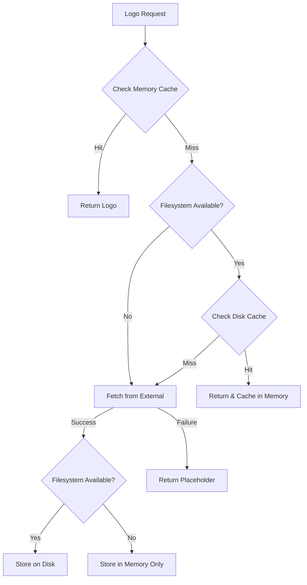

# William Callahan's Personal Website

## Logo Storage and Docker Deployment

### Volume Configuration

**Docker Volume Details:**
- Volume Name: `logo_storage`
- Container Mount Path: `/app/public/logos`
- Purpose: Persistent storage for fetched company logos

Example mount:
```bash
docker run -v logo_storage:/app/public/logos ...
```

The system works with or without this volume configured. When the volume is not available, it automatically falls back to memory-only caching and re-fetches logos as needed.

### How Logo Storage Works

The logo system follows a multi-layered caching approach:

1. **Memory Cache** (Ephemeral, Fast)
   - First layer of caching using `ServerCache`
   - Clears when the container restarts
   - Provides fastest access for frequently requested logos

2. **Filesystem Cache** (Optional Persistence)
   - Stored in `/app/public/logos`
   - Can be persistent with Docker volume
   - Falls back to ephemeral storage if volume isn't mounted
   - Logos stored with hashed filenames: `{md5(domain)}-{source}.png`

3. **External Fetching** (Fallback)
   - Attempts multiple sources (Google, Clearbit, DuckDuckGo)
   - Validates logos to filter out generic icons
   - Converts all logos to PNG for consistency

### Deployment Instructions

#### 1. Basic Deployment (Ephemeral Storage)
```bash
# Build the image
docker build -t williamcallahan-website .

# Run with ephemeral storage
docker run -d \
  -p 3000:3000 \
  --name williamcallahan-website \
  williamcallahan-website
```
In this mode:
- Logos are stored in container's filesystem
- Storage clears on container restart
- System automatically re-fetches logos as needed
- No volume management required
- Suitable for testing or when persistence isn't critical

#### 2. Persistent Storage Deployment
```bash
# Create a named volume
docker volume create logo_storage

# Build the image
docker build -t williamcallahan-website .

# Run with persistent storage
docker run -d \
  -p 3000:3000 \
  -v logo_storage:/app/public/logos \
  --name williamcallahan-website \
  williamcallahan-website

# Optional: Fix volume permissions if needed
docker run --rm \
  -v logo_storage:/data \
  alpine chown -R 1001:1001 /data
```

#### 3. Production Deployment with Docker Compose
```yaml
# docker-compose.yml
version: '3.8'
services:
  website:
    build: .
    restart: unless-stopped
    ports:
      - "3000:3000"
    volumes:
      - logo_storage:/app/public/logos
    environment:
      - NODE_ENV=production
      - PORT=3000
      - HOSTNAME=0.0.0.0
    healthcheck:
      test: ["CMD", "curl", "-f", "http://localhost:3000/api/health"]
      interval: 30s
      timeout: 10s
      retries: 3

volumes:
  logo_storage:
    driver: local  # Use local for development
    # For production, you might use:
    # driver: your-storage-driver
    # driver_opts:
    #   type: nfs
    #   o: addr=storage-server,rw
    #   device: ":/path/to/storage"
```

#### 4. Kubernetes Deployment
```yaml
# deployment.yaml
apiVersion: apps/v1
kind: Deployment
metadata:
  name: williamcallahan-website
spec:
  replicas: 2
  template:
    spec:
      containers:
      - name: website
        image: williamcallahan-website
        volumeMounts:
        - name: logo-storage
          mountPath: /app/public/logos
      volumes:
      - name: logo-storage
        persistentVolumeClaim:
          claimName: logo-storage-pvc

---
# pvc.yaml
apiVersion: v1
kind: PersistentVolumeClaim
metadata:
  name: logo-storage-pvc
spec:
  accessModes:
    - ReadWriteMany
  resources:
    requests:
      storage: 10Gi
```

### System Resilience

The logo system is designed to be resilient and self-healing:

1. **Filesystem Availability Check**
```typescript
// Automatic filesystem check on startup
const hasFileSystem = await ensureLogosDirectory();
if (!hasFileSystem) {
  console.warn('Filesystem storage unavailable, falling back to memory-only mode');
}
```

2. **Storage Fallback Chain**


3. **Error Recovery**
- Automatic retry on transient failures
- Graceful fallback to placeholder images
- Separate error caching to prevent API hammering

### Maintenance Operations

1. **Clear Cache**
```bash
# Memory cache only (soft reset)
curl -X POST http://localhost:3000/api/cache/clear

# Full reset (memory + disk)
docker volume rm logo_storage
docker volume create logo_storage
docker restart williamcallahan-website
```

2. **Backup Logos**
```bash
# Create backup
docker run --rm \
  -v logo_storage:/data \
  -v $(pwd)/backup:/backup \
  alpine tar czf /backup/logos.tar.gz /data

# Restore backup
docker run --rm \
  -v logo_storage:/data \
  -v $(pwd)/backup:/backup \
  alpine tar xzf /backup/logos.tar.gz -C /
```

3. **Health Check**
```bash
# Check system health
curl http://localhost:3000/api/health

# View logs
docker logs williamcallahan-website
```

### Best Practices

1. **Production Deployment**
- Always use persistent volumes in production
- Implement regular backups
- Monitor storage usage
- Set up health checks

2. **Development/Testing**
- Use ephemeral storage for faster iteration
- Clear cache frequently during testing
- Monitor API rate limits

3. **Maintenance**
- Regular health checks
- Periodic cache cleanup
- Storage usage monitoring
- API access verification

The system is designed to be resilient and self-healing, automatically adapting to the available storage options while maintaining functionality in all scenarios. Whether running with persistent storage or in ephemeral mode, the logo fetching and caching system will continue to function effectively.

## Development

### Dependency Management

The project uses `madge` to detect and prevent circular dependencies:

```bash
# Check for circular dependencies
npx madge --circular --extensions ts,tsx .

# Visualize dependency graph (outputs graph.svg)
npx madge --image graph.svg --extensions ts,tsx .
```

For detailed guidelines on preventing circular dependencies and best practices for component organization, see:
- [Development Best Practices](docs/development/best-practices.md)
- [Component Architecture](docs/architecture/state-management.md)

Run dependency checks before committing changes:
```bash
# Check dependencies
npm run validate  # Includes circular dependency check
```

For more information about the project's development practices and guidelines, refer to:
- [Development Best Practices](docs/development/best-practices.md)
- [Testing Guidelines](docs/development/testing.md)
