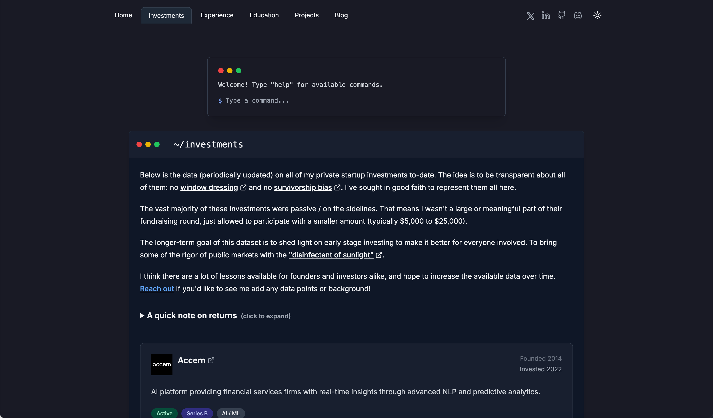

# williamcallahan.com



A personal website monorepo featuring a terminal-inspired UI, semantic search, and an automated content pipeline. Built with Next.js 16, React 19, and TypeScript.

## Quick Start

### Local Development

```bash
# Install dependencies
bun install

# Start development server
bun dev
```

### Docker Deployment

```bash
docker build -t williamcallahan-com .
docker run -d -p 3000:3000 williamcallahan-com
```

For production deployment with persistent storage, see the [Deployment Guide](docs/ops/deployment.md).

## Documentation

- **Architecture Overview**: [docs/architecture/README.md](docs/architecture/README.md)
- **Feature Documentation**: [docs/features/](docs/features/)
- **Agent Rules**: [AGENTS.md](AGENTS.md)

## Operations & Runbooks

- [Deployment Guide](docs/ops/deployment.md)
- [Observability & Monitoring](docs/ops/observability.md)
- [Verification](docs/ops/verification.md)

## Core Features

- **Terminal UI**: Interactive terminal with filesystem-like navigation and command history.
- **Content Pipeline**: Automated ingestion of bookmarks, GitHub activity, and blog posts to S3.
- **Semantic Search**: Vector-based search for content and bookmarks.
- **Logo Caching**: 3-tier caching system (Memory -> Disk -> External) for company logos.

## License

[MIT](LICENSE)
