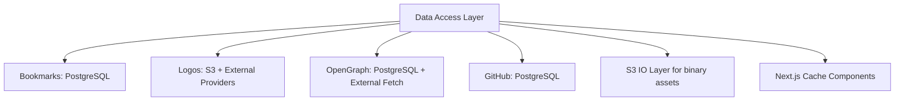

# Data Access Layer Architecture

## Overview

This document describes how williamcallahan.com reads and writes runtime data across PostgreSQL, S3, and Next.js Cache Components.

### Key Components

## Core Modules

### Data Access Modules (`src/lib/data-access/*`)

- Purpose: domain-focused read/write orchestration.
- Import policy: import source modules directly; no barrel re-exports.
- Storage policy: S3 operations go through `src/lib/s3/*`; bookmark runtime reads/writes go through `src/lib/db/*`.

### S3 Operations (`src/lib/s3/*`)

- Purpose: shared object storage boundary for JSON and binary payloads.
- Runtime JSON policy: production JSON persistence resolves to PostgreSQL (`json_documents`) through `src/lib/s3/json.ts`; non-production keeps direct S3 behavior for local/test compatibility.
- Key capabilities:
  - Raw object operations in `src/lib/s3/objects.ts`
  - JSON helpers in `src/lib/s3/json.ts`
  - Binary helpers in `src/lib/s3/binary.ts`
  - Client and retry strategy in `src/lib/s3/client.ts`
  - Config validation in `src/lib/s3/config.ts`
  - Canonical errors in `src/lib/s3/errors.ts`
- Security controls:
  - URL and path validation before fetch/write operations
  - Path traversal protections for S3 keys
  - CDN URL construction is explicit at call sites

### Next.js Cache Components

- Purpose: request/render caching for server-side data functions.
- Primary primitives:
  - `"use cache"`
  - `cacheLife(...)`
  - `cacheTag(...)`
  - `revalidateTag(...)`
- API routes are excluded and use `unstable_noStore()` when fresh reads are required.

## Domain Flows

### Bookmarks Data Access (`src/lib/bookmarks/*`, `src/lib/db/*`)

- Runtime source of truth: PostgreSQL read model.
- Refresh pipeline: external bookmark ingestion -> normalized records -> Drizzle mutations.
- Concurrency controls:
  - non-overlapping refresh execution
  - in-flight deduplication for expensive refresh calls
- Validation:
  - schema validation at the IO boundary
  - dataset guardrails before persistence

#### PostgreSQL Bookmark Runtime

- `src/lib/db/connection.ts`: initializes Drizzle + postgres-js with explicit `DATABASE_URL` guard.
- `src/lib/db/schema/bookmarks.ts`: bookmark table with full-text and vector indexes.
- `src/lib/db/schema/bookmark-taxonomy.ts`: tag links and index-state tables.
- `src/lib/db/queries/bookmarks.ts`: paginated/query read model APIs.
- `src/lib/db/mutations/bookmarks.ts`: write model for upsert/delete and taxonomy rebuilds.
- `src/lib/db/bookmark-record-mapper.ts`: schema-backed row mapper at the DB boundary.

#### Bookmark API and Orchestration

- `src/lib/bookmarks/bookmarks.ts` coordinates fetch/normalize/enrich/persist flows.
- OpenGraph enrichment runs in bounded batches.
- Failure paths return durable persisted data instead of ad-hoc runtime cache fallbacks.

#### Sitemap Bookmark Streaming

- Files: `src/app/sitemap.ts`, `src/lib/bookmarks/service.server.ts`.
- Strategy: iterate paginated bookmark data rather than loading full corpus in one read.
- Benefit: predictable request/build memory behavior under large datasets.

#### Client-Side Bookmark Access

- `src/lib/bookmarks.client.ts` wraps server APIs for browser callers.
- Client behavior focuses on API fetch lifecycles, not server in-process cache coordination.

#### Bookmark Validation

- `src/lib/validators/bookmarks.ts` enforces dataset safety checks before writes.
- Validation failures are logged and block destructive updates.

### Logos Data Access (`src/lib/data-access/logos.ts`)

- Hierarchy: S3/manifest -> provider fetch -> placeholder fallback.
- Persistence: deterministic S3 keys with source-aware naming.
- Provider handling: retries, bounded timeouts, and source prioritization.
- Caching model: Next.js cache wrappers for server reads plus durable S3 artifacts.

### External Logo Fetching (`src/lib/data-access/logos/external-fetch.ts`)

- Source order and request headers are centralized.
- Timeouts and validation prevent long-hanging or invalid payload paths.
- Buffer/content checks enforce image-type correctness before persistence.

### OpenGraph Data Access (`src/lib/data-access/opengraph*.ts`)

- Reads/writes metadata and overrides through PostgreSQL modules.
- Keeps image assets in object storage.
- Uses cache tags for controlled invalidation across pages and APIs.
- Refresh flows maintain in-flight deduplication to avoid duplicate remote work.

### GitHub Data Access (`src/lib/data-access/github*.ts`)

- Refresh jobs persist summary/statistics payloads to PostgreSQL.
- UI/server read flows hydrate from PostgreSQL + Next.js cache tags.
- Public API routes use no-store reads when freshness is required.

## Performance and Reliability

- Durable first: S3 or PostgreSQL state is the persistence boundary.
- Cache Components: reduce duplicate read work in RSC/server contexts.
- Streaming IO: large payload operations avoid unnecessary full buffering.
- Failures degrade to durable state, not hidden in-process cache state.

## Security and Type Safety

- External data is validated at boundaries (schema-first contracts).
- URL and host validation protects remote fetch paths.
- DB writes are constrained by environment/runtime guards.
- Serialization contracts are explicit between data-access and UI layers.

## Related Docs

- `docs/architecture/s3-storage.md`
- `docs/architecture/image-handling.md`
- `docs/features/bookmarks.md`
- `docs/standards/type-policy.md`
