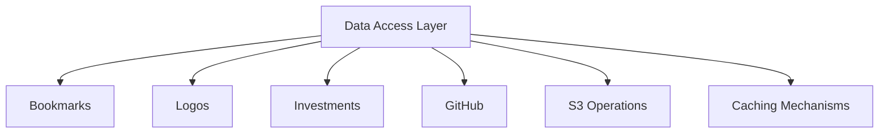

# Data Access Layer Architecture

## Overview

This document outlines the data access layer for the William Callahan website, detailing how data retrieval and storage operations are managed within the application.

### Key Components

## Core Logic

### Unified Data Access (`lib/data-access.ts`)

- **Purpose**: Serves as a central import point for various data access functionalities, re-exporting modules related to bookmarks, logos, investments, and GitHub data.
- **Key Features**:
  - Simplifies access to data operations by providing a single entry point for imports.
  - Notes the removal of original S3 helper functions, directing users to utilize utilities from '@/lib/s3-utils' for comprehensive S3 operations.

### S3 Operations (`lib/s3-utils.ts`)

- **Purpose**: Provides a comprehensive interface for interacting with Amazon S3 to manage data storage and retrieval operations.
- **Key Features**:
  - Implements functions for reading (`readFromS3`), writing (`writeToS3`), checking existence (`checkIfS3ObjectExists`), retrieving metadata (`getS3ObjectMetadata`), listing objects (`listS3Objects`), and deleting objects (`deleteFromS3`) from S3.
  - Supports specialized handling for JSON data with `readJsonS3` and `writeJsonS3`, and binary data with `readBinaryS3` and `writeBinaryS3`.
  - Incorporates retry logic for read operations with configurable maximum retries and delay to handle transient errors.
  - Utilizes a public CDN URL for non-JSON files to optimize access speed, falling back to direct S3 reads if CDN fetch fails.
  - Configures S3 client using environment variables for bucket, endpoint, credentials, and region, with support for dry runs to simulate operations without actual S3 interaction.
  - Ensures public read access for written objects by setting the appropriate ACL during write operations.
- **Security Features**:
  - All external URLs validated against SSRF attacks before fetch operations
  - Path traversal protection for S3 keys
  - Proper use of `S3_CDN_URL` for server-side code instead of `NEXT_PUBLIC_` variables

### Caching Mechanisms (`lib/cache.ts`)

- **Purpose**: Handles temporary data storage to improve application performance through efficient caching.
- **Key Features**:
  - Utilizes the 'node-cache' library to create a cache instance with a default TTL (Time To Live) of 30 days.
  - Configures a check period of 24 hours to manage expired keys, ensuring outdated data is removed periodically.
  - Disables cloning of stored data to optimize performance by directly referencing original objects.
  - Defines TTL constants for flexible expiration settings: DEFAULT (30 days), DAILY (24 hours), and HOURLY (1 hour).
  - Provides a centralized cache instance for use across the application to store and retrieve data efficiently.

### Cache Debugging Middleware (`middleware/cache-debug.ts`)

- **Purpose**: Enhances debugging capabilities in development environments by adding cache statistics to API responses.
- **Key Features**:
  - Operates only in development mode, ensuring no performance impact in production.
  - Targets specific API routes related to caching such as '/api/logo', '/api/bookmarks', and '/api/github-activity'.
  - Appends custom headers to responses with cache metrics including hits, misses, and the number of keys.
  - Utilizes 'ServerCacheInstance' from '@/lib/server-cache' to retrieve cache statistics for detailed monitoring.

### Server-Side Cache Management (`lib/server-cache.ts`)

- **Purpose**: Provides a comprehensive server-side in-memory caching system for various application data types to optimize performance.
- **Key Features**:
  - Implements a `ServerCache` class extending 'node-cache' with a default TTL of configurable duration (from constants in 'constants.ts').
  - Manages caching for logos (validation, fetch results, inverted logos, analysis), bookmarks, GitHub activity, and OpenGraph data.
  - Uses a singleton pattern with `ServerCacheInstance` to ensure a single cache instance across the application.
  - Offers specific methods for getting, setting, and clearing cache entries with tailored TTLs for success and failure scenarios.
  - Includes logic to determine if cached data needs refreshing based on revalidation thresholds to prevent stale data usage.
  - Ensures server-only execution with `assertServerOnly` to prevent client-side cache operations.

### Bookmarks Data Access (`lib/data-access/bookmarks.ts`)

- **Purpose**: Manages the retrieval, caching, and persistence of bookmark data using a hierarchical access pattern (in-memory cache → S3 storage → external API).
- **Key Features**:
  - Implements a tiered access strategy, prioritizing in-memory cache, then S3 storage, and finally an external API as a fallback to optimize performance.
  - Utilizes S3-based distributed locking to coordinate refresh operations across multiple instances, preventing concurrent refreshes and ensuring data consistency.
  - Validates bookmark data before persistence to prevent overwriting with invalid or test data, safeguarding data integrity with detailed checks for suspicious content.
  - Handles non-blocking background refreshes to keep the main request flow responsive, updating data without impacting user experience.
  - Manages in-flight promises to avoid duplicate simultaneous fetches of external bookmark data, reducing unnecessary API calls.
  - Persists refreshed data to S3 and updates the server cache, maintaining consistency across storage layers with retry mechanisms for robustness.
- **Validation Features**:
  - All bookmark URLs validated with Zod schemas before processing
  - External URLs checked against SSRF attack patterns
  - Enhanced data validation with comprehensive schemas in `types/schemas/`

#### Bookmarks API and Data Management (`lib/bookmarks.ts`)

- **Purpose**: Oversees the fetching, normalization, caching, and enrichment of bookmark data from an external API (Hoarder/Karakeep).
- **Key Features**:
  - Implements a multi-tiered caching strategy using in-memory server cache and S3 storage to optimize data retrieval and minimize redundant API calls.
  - Handles pagination for API requests to fetch all bookmarks across multiple pages, incorporating timeout safeguards to prevent hanging on slow responses.
  - Performs non-blocking background refreshes to update data without impacting the main request flow, ensuring a responsive user experience.
  - Normalizes raw API data into a unified bookmark format, omitting large fields like HTML content to reduce payload size and improve efficiency.
  - Enriches bookmarks with OpenGraph metadata in controlled batches with jittered delays to optimize network usage and respect external service limits.
  - Validates datasets before persistence using safeguard mechanisms to prevent overwriting with invalid or test data, ensuring data integrity.
  - Provides robust fallback mechanisms to return cached or S3 data in case of fetch failures, enhancing application resilience during API downtime.

#### Sitemap Bookmark Streaming (`app/sitemap.ts` + `lib/bookmarks/service.server.ts`)

- **Purpose**: Generates the sitemap at request time without loading the entire bookmark corpus into memory.
- **Key Features**:
  - Uses `getBookmarksIndex()` to determine the number of paginated S3 snapshots and then iterates them sequentially with `getBookmarksPage(pageNumber)`.
  - Aggregates bookmark and tag metadata in small chunks, ensuring builds and runtime requests stay within heap limits.
  - Respects the same cache tags as the rest of the bookmarks stack so ISR invalidations continue to work end-to-end.

#### Client-Side Bookmark Operations (`lib/bookmarks.client.ts`)

- **Purpose**: Serves as a client-side API wrapper for fetching bookmark data, optimized for browser environments.
- **Key Features**:
  - Utilizes in-memory caching to reduce redundant API calls and improve performance on the client side.
  - Interacts with a backend API endpoint to fetch bookmark data, ensuring data consistency with server-side storage.
  - Supports background refreshes to update data without blocking the main request flow, maintaining a responsive user experience.
  - Provides methods to trigger explicit data refreshes and update the client-side cache with the latest data from the server.

#### Bookmark Data Validation (`lib/validators/bookmarks.ts`)

- **Purpose**: Provides validation utilities for bookmark data to prevent accidental overwrites with invalid or test data during refresh operations.
- **Key Features**:
  - Checks for suspicious single test bookmarks by examining if there's only one bookmark with a title matching a test pattern.
  - Validates datasets to ensure not all bookmarks are missing URLs, which would indicate invalid data.
  - Includes detailed logging for debugging purposes when validation fails, aiding in root cause analysis.

### Logos Data Access (`lib/data-access/logos.ts`)

- **Purpose**: Manages the fetching, caching, and persistence of logo data for domains using a multi-tiered approach.
- **Key Features**:
  - Implements a hierarchical access pattern: in-memory cache, S3 storage, external APIs (Google, Clearbit, DuckDuckGo), and a placeholder logo as a fallback.
  - Supports retry logic with exponential backoff for failed logo fetches, up to a configurable maximum number of attempts.
  - Handles logo storage in S3 with source tracking in filenames to maintain provenance (e.g., google, duckduckgo).
  - Provides a placeholder logo mechanism for consistent failures, storing it in S3 to avoid repeated failed attempts.
  - Caches successful and failed fetch results in memory using `ServerCacheInstance` to optimize performance and reduce redundant requests.
  - Determines content type (SVG or PNG) based on buffer content analysis to ensure correct rendering.

#### External Logo Fetching (`lib/data-access/logos/external-fetch.ts`)

- **Purpose**: Handles the retrieval of company logos from external providers with a prioritized approach.
- **Key Features**:
  - Fetches logos sequentially from sources in priority order: Google HD, Clearbit HD, Google MD, Clearbit MD, DuckDuckGo HD.
  - Uses browser-like headers to mimic user requests and avoid bot detection during fetches.
  - Implements timeouts (5 seconds per source) to prevent hanging on slow responses.
  - Validates logo buffers for size and content, ensuring only valid images are processed.
  - Integrates with a validation API (`/api/validate-logo`) to filter out generic globe icons when available.
  - Processes image buffers to standardize format, converting to PNG if not SVG, and determines content type for correct rendering.
- **Performance Optimizations**:
  - Parallel fetching with Promise.allSettled() for all logo sources
  - Batch S3 existence checking for multiple logos
  - Reduced worst-case fetch time from 30s to ~6s

#### Client-Side Logo Fetching and Caching (`lib/logo.ts`)

- **Purpose**: Manages client-side logo fetching and caching to optimize performance in browser environments.
- **Key Features**:
  - Implements localStorage caching with a 30-day duration to reduce redundant API calls for logo data.
  - Follows a flow of checking the local cache before making API calls to `/api/logo` endpoint for logo retrieval.
  - Handles domain extraction from URLs or company names to ensure accurate logo fetching.
  - Includes error handling with a custom `LogoError` class for robust error management.
  - Provides functionality to clear the cache, allowing for forced refreshes of logo data when needed.
  - Determines logo source and content type from URLs to ensure correct rendering and attribution.
