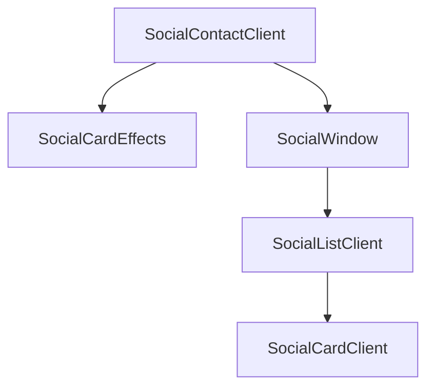

# Social Contact Feature Architecture

## Overview

This document outlines the architecture of the Social Contact feature, which displays social media profiles and links in a visually appealing, interactive windowed interface on the website.

### Key Components

## Core Logic

### Social Contact Client (`components/features/social/contact.client.tsx`)

- **Purpose**: Main entry point for the Social feature, managing client-side rendering and hydration safety.
- **Key Features**:
  - Uses `useState` and `useEffect` to delay rendering until the component is mounted, preventing hydration mismatches.
  - Wraps the content in a container with `SocialCardEffects` for styling and `SocialWindow` for windowed UI.

### Social Window (`components/features/social/social-window.client.tsx`)

- **Purpose**: Manages the window state (normal, minimized, maximized, closed) for the Social feature, rendering content within a desktop-like UI.
- **Key Features**:
  - Utilizes `useRegisteredWindowState` for global window state management.
  - Implements hydration safety with delayed mounting.
  - Dynamically imports content to prevent server-side rendering issues.
  - Provides window controls for user interaction (close, minimize, maximize).

### Social List Client (`components/features/social/social-list.client.tsx`)

- **Purpose**: Renders a grid of social media profile cards with hydration safety.
- **Key Features**:
  - Delays rendering until mounted to prevent hydration mismatches.
  - Displays a brief introductory text about the social media presence.
  - Maps over a list of social links to render individual cards using `SocialCardClient`.

### Social Card Client (`components/features/social/social-card.client.tsx`)

- **Purpose**: Displays individual social media profile cards with dynamic image fetching and fallback mechanisms.
- **Key Features**:
  - Fetches OpenGraph images for profile and banner with API calls, falling back to predefined images for specific platforms.
  - Handles image loading states and errors with appropriate UI feedback.
  - Extracts domain and user handle from URLs for display.
  - Provides categorized tags and descriptions based on the social network.

### Social Card Effects (`components/features/social/social-card-effects.client.tsx`)

- **Purpose**: Applies CSS styles for hover effects on social media cards.
- **Key Features**:
  - Imports external CSS for maintainability, serving as a wrapper with no rendered content.

### Social Styles (`styles/social-styles.css`)

- **Purpose**: Defines CSS styles for social media cards, including brand-specific hover effects and transitions.
- **Key Features**:
  - Applies base styling for consistent background and transitions.
  - Defines hover effects with brand colors for LinkedIn, GitHub, Twitter, Bluesky, and Discord.
  - Includes subtle scale effects on banner images for interactivity.

## Type Definitions

### Social Link Types (`types/social.ts`)

- **Purpose**: Provides TypeScript type definitions and runtime validation for social media links
- **Key Features**:
  - `socialLinkSchema`: Zod schema for runtime validation
    - `href`: URL string validation
    - `label`: String for accessibility
    - `icon`: Component reference (typed as `any` due to Zod limitations)
    - `emphasized`: Optional boolean for visual prominence
  - `SocialIconProps` / `SocialLink`: TypeScript types derived from schema
  - ** ISSUE**: Icon property typed as `z.any()` loses type safety for icon components

## Social Icons

### Icon Components (`components/ui/social-icons/`)

- **Base Icon** (`base-icon.tsx`): Abstract base component for consistent icon styling
- **Platform Icons**: Individual icon components for each platform
  - `x-icon.tsx`: X (Twitter) icon
  - `discord-icon.tsx`: Discord icon
  - `bluesky-icon.tsx`: Bluesky icon
  - `linkedin-icon.tsx`: LinkedIn icon
  - `github-icon.tsx`: GitHub icon
  - `aventure-icon.tsx`: Aventure capital icon
  - `individual-icon.tsx`: Individual investor icon

### Social Icon Component (`components/ui/social-icons/social-icon.tsx`)

- **Purpose**: Renders individual social media links with icons
- **Key Features**:
  - Accepts icon component, href, and label props
  - Wraps icons in accessible links
  - Consistent styling and hover effects

### Social Icons List (`components/ui/social-icons/social-icons.client.tsx`)

- **Purpose**: Displays a horizontal list of social media icons
- **Key Features**:
  - Maps over social links data
  - Responsive layout with proper spacing
  - Client-side component for interactivity

### Social Links Data (`components/ui/social-icons/social-links.ts`)

- **Purpose**: Centralized data source for all social media links
- **Key Features**:
  - Array of social link objects
  - Each link includes href, label, icon component, and optional emphasis
  - Single source of truth for social media presence

## Security & Quality Issues

### MEDIUM Priority Issues

1. **Type Safety Loss** (`types/social.ts`)
   - Icon property typed as `z.any()` due to Zod limitations
   - Loses compile-time type checking for icon components
   - **Fix**: Create custom type guard or use discriminated union

### LOW Priority Issues

1. **CSS Dead Code** (`styles/social-styles.css`)
   - Hover effects set `height: 0` for ::after elements
   - Colored bars feature never implemented
   - **Fix**: Either implement the feature or remove dead code

2. **Complex CSS Selectors** (`app/globals.css`)
   - Social icon fixes use overly specific selectors (lines 335-387)
   - Hard to maintain and understand
   - **Fix**: Simplify using data attributes or dedicated classes

## Dependencies

- **React**: For component rendering and state management.
- **Next.js**: For dynamic imports and image optimization.
- **Lucide React**: For icons used in the UI.
- **Custom Utilities**: For class name merging and external link components.
- **Zod**: For runtime type validation of social links.

## Architecture Summary

The Social Contact feature follows a modular, client-side architecture with a focus on user interactivity and visual appeal. It uses a windowed interface consistent with other features on the site, ensuring a cohesive user experience. The feature prioritizes hydration safety to prevent rendering issues and employs dynamic image fetching for up-to-date social media visuals, with robust fallbacks for reliability.

## Improvements Needed

1. **Type Safety**
   - Implement proper typing for icon components
   - Add runtime validation for social link data
   - Create type-safe icon component registry

2. **CSS Optimization**
   - Remove dead hover effect code
   - Simplify complex selectors
   - Consider CSS-in-JS for component-scoped styles

3. **Performance**
   - Implement lazy loading for social card images
   - Add resource hints for external image domains
   - Cache OpenGraph image URLs

4. **Accessibility**
   - Ensure all social links have proper ARIA labels
   - Add keyboard navigation support for card grid
   - Provide alternative text for profile images
